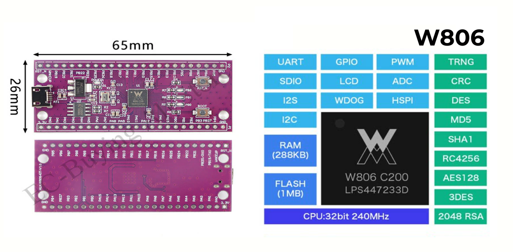
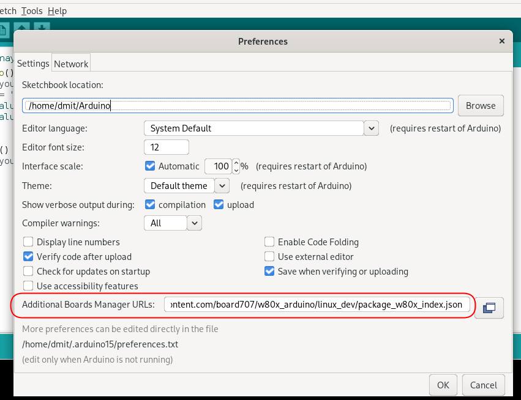
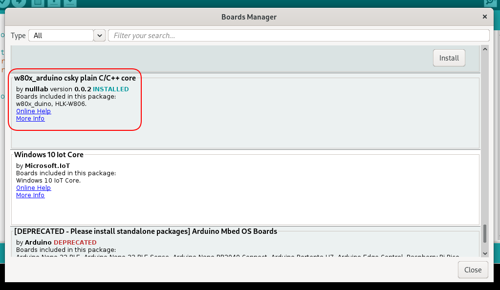
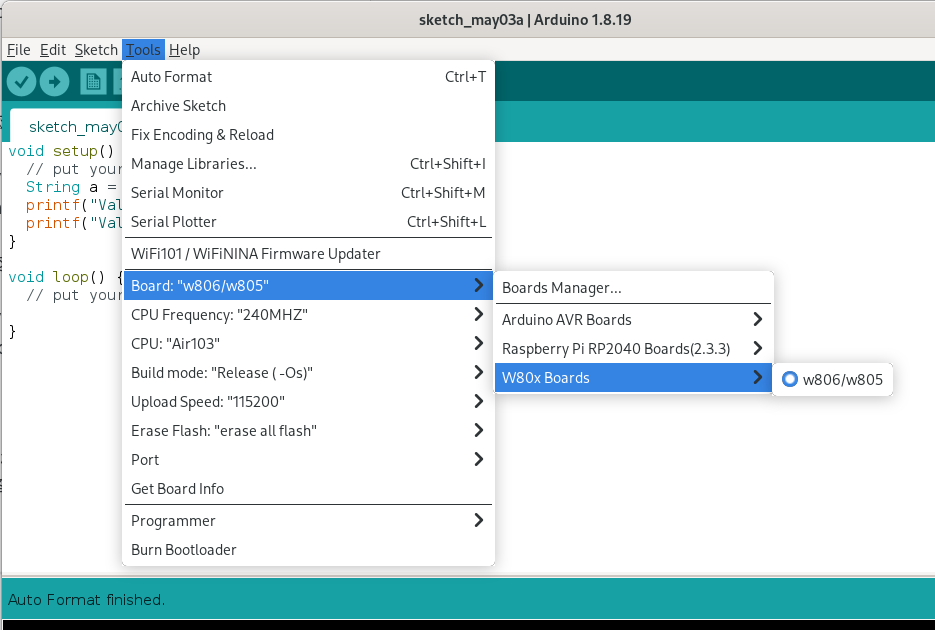

# w80x_duino
Arduino package for [WinnerMicro](http://www.winnermicro.com/) boards, based on XT-E804 MCU.

This is a port of the WinnerMicro W806 SDK to the Arduino world. It uses T-HEAD C-SKY Tools V3.10.29 Minilibc abiv2 toolchain (GCC v6.3.0)

## Boards

- W806 ([pinout](doc/W806_pinout.png)) 
- W801 ([pinout](doc/W801_pinout.png)) 
- Air_103 (W806 clone) ([pinout](doc/Air103_pinout.png)) 

## Package development - what works and what not

The ticked options have been implemented and tested, the unticked ones are under development, and more developers are expected to maintain together

- [x] Arduino IDE package tools for Windows and Linux 
- [x] GPIO
- [x] [HardwareSerial](cores/w806/HardwareSerial.md) class
- [x] ADC
- [x] [PWM](doc/PWM.md)
- [x] [HardwareTimer](libraries/HardwareTimer/Readme.md) lib
- [x] I2C - HardwareI2c, SoftwareI2c
- [x] [SPI](doc/SPI.md)
- [x] [EEPROM](libraries/EEPROM/Readme.md) library
- [x] Stream, Print and String classes
- [ ] I2S interface
- [ ] SDIO interface
- [ ] DMA 

## Installation in Arduino IDE

1. **File -> Preferences**

2. Enter the following URL in the additional development board manager URL:

> https://raw.githubusercontent.com/board707/w80x_arduino/hal-v0.6.0/package_w80x_index.json

3. **Tools -> Boards -> Boards Manager...**
Search for **w80x_duino**, select the latest version to install 

4. **Tools -> Boards**

**Notes to Linux users**

If you experienced the error at the first build under linux:

`/w80x_duino/tools/w80x_tool/v1.0/lin/wm_tool: /lib64/libc.so.6: version GLIBC_2.34 not found `

or something like it, just go to your `w80x_duino/tools/w80x_tool/v1.0/lin/` folder and remove the `wm_tool` and `wm_toold` files.
After that start building again and now the error should gone.

### Support
If you have any problems using the package, please submit an issue directly. Developers are welcome to collaborate and develop and submit commits. This project will continue to be updated.

## W806 MCU Info

 - QFN56 package, 6mm x 6mm, pitch 0.35mm

**Main Features**

- Integrated 32-bit XT804 processor, operating frequency 240MHz, built-in DSP, floating point unit and security engine
- Builtin 1MB Flash(2MB for W801)，288KB RAM
- Integrated PSRAM interface, supports up to 64MB external PSRAM memory
- 6x high-speed UARTs
- 4-port 16-bit ADC，max sample rate 1KHz
- 1 high-speed SPI（slave mode），up to 50MHz
- 1 SPI (master - slave mode)
- 1 SDIO_HOST，supports SDIO2.0、SDHC、MMC4.2
- 1 SDIO_DEVICE，supports SDIO2.0，up to 200Mbps
- 1 Hardware I2C 
- up to 44 GPIOs
- 5-channels PWM
- 1 Duplex I2S interface
- LCD interface，supports 4x32 device
- 1 7816 interface
- 15 Touch Sensor

**Power options**

- 3.3V single supply
- Sleep, standy and shutdown power modes
- Standby power consumption is less than 10uA

## Credits
- Hi-Link developed and produced this development board
- This open source project is maintained on base of the nulllab team project [nulllab team](https://github.com/nulllaborg)

Original [README](README_ch.md) (chinesse)

